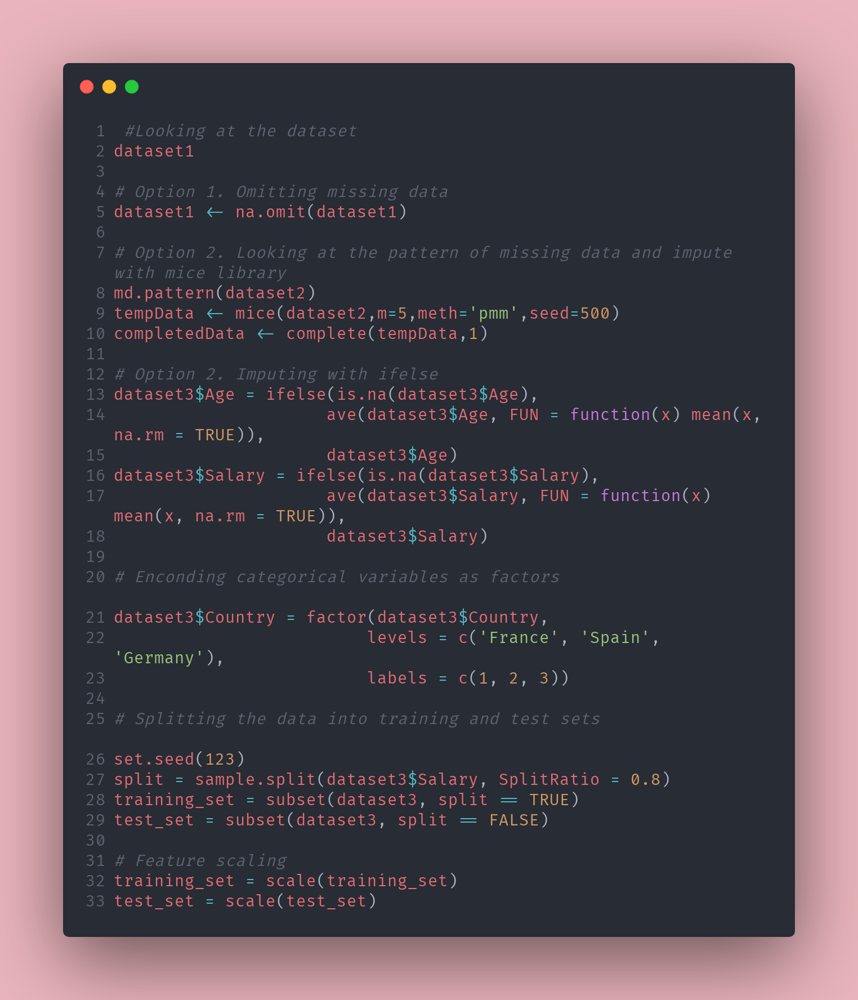

```{r setup, include = FALSE}
knitr::opts_chunk$set(collapse = TRUE, echo=TRUE, eval=TRUE, warning=FALSE, message=FALSE, comment="  ")
```

This post is based on the [Machine Learning A-Z™: Hands-on Python & R In Data Science](https://www.udemy.com/course/machinelearning/) course on Udemy that i'm taking.
It's a general introduction to the most used and known machine learning algorithms. This is the first chapter and a non-negotiable step not only for machine learning but also for every data analysis.  

This'll be a blend of concepts introduced in the course and other personal considerations to make it more complete. There few general steps to take into account  

*	Understanding which variables are dependent and independent  

*	Load the data and ponder whether you should impute or remove missing data  

*	Encode categorical variables miss interpreted by R and re-encode them as binary  

*	Splitting dataset into training and test set  

*	Feature Scaling with Standardization or Normalization  

First of all, let's import the data set.

```{r, include=FALSE, tidy=FALSE}
dataset1 <- read.csv("Data.csv")
dataset2 <- read.csv("Data.csv")
dataset3 <- read.csv("Data.csv")
library(mice)
library(caTools)
library(tidyverse)
```

```{r}
dataset1
```
Well, there's no way to proceed forward with any machine learning model if no dependent and independent variables are identified.  

There shouldn't be the need to explain this but what we're trying to do is to find a relationship between the independent variable and the dependent variable so that we can observe how one can influence the other.   

Sometimes it's pretty clear who's dependent and who's independent, but many times it takes a bit of prior knowledge/thinking to correctly identify who's who.  

Also, and we're talking more in-depth about that when we're seeing regression models, not every independent variable has the same effect on the dependent, and their role needs to be assessed.  

Dealing with missing data can be a real pain in the ass. Though it's a crucial step, too often it's treated as "yo, delete missing values and go on" and that can ruin your analysis.  

Whether to impute or delete missing values it's an intricated topic that requires a lot of critical thinking and it's also highly case dependent.  

This removes all missing data (NAs).  

```{r}
dataset1 <- na.omit(dataset1)
dataset1
```
Let's say that we've decided we're going with data deletion, there're a couple of general rules we have to take into account when doing it. Again, it's highly dependent on your specific case but we can at least agree on something.  

The amount of data that's missing should be as low as possible and the whole dataset should have enough observation. Unfortunately, there're no clear guidelines on what's the acceptable number of missing data related to the size of the dataset.  

* If a whole observation has missing data for every variable, we can take into consideration the removal of the observation (optimal if these missing observations represent a casual subgroup of the whole group).  

* If a variable has missing data for every observation, we can take into consideration the removal of the variable (not if the variable is fundamental for our analysis).  

Both methods should be pondered seriously and both suffer from the risk of inducing a **Selection Bias**, 'cause we gotta understand the underlying mechanism that's generated the missing values.   

If there's a reason why those values are missing we could completely misdirect the analysis and unconsciously select a group that's not representative of the whole population.  

If the missing values are randomly distributed, removing them might cause the loss of too much info and therefore might be safer to impute them.  

```{r}
md.pattern(dataset2)

```

See what's the pattern of missing data and then impute them

```{r, results='hide'}
tempData <- mice(dataset2,m=5,meth='pmm',seed=500)
completedData <- complete(tempData,1)
```

We can decide to impute data using the mean and `mice` package.  

If you decide imputing data is the road you wanna go with, next step it's to assess how to impute data. For short, imputing means to substitute missing data with new alternatives that're coherent/plausible, obtained from the dataset or external sources, or both.  

The idea is to reduce the distortion introduced by missing data to the lowest degree possible. Ofc they have their fair share of disadvantages, 'cause we are considering our imputed data as "true observations". The underlying idea is to preserve statistical accuracy.  

There are different ways to impute data, and all have to be considered based on the internal characteristics of the dataset, but we can summarize them as  

* Imputing the mean (reduces internal variance)  

* Imputing the median  

* Hot deck imputation  

* Imputation through EM (expectation-maximization)  

Another useful way to do it is through the function `ifelse`

```{r}
dataset3$Age = ifelse(is.na(dataset3$Age),
                     ave(dataset3$Age, FUN = function(x) mean(x, na.rm = TRUE)),
                     dataset3$Age)
dataset3$Salary = ifelse(is.na(dataset3$Salary),
                     ave(dataset3$Salary, FUN = function(x) mean(x, na.rm = TRUE)),
                     dataset3$Salary)
```

Another thing we gotta keep in mind is that R most of the time misinterprets the class of some data and it needs to be fixed.   

To do so, we need to convert categorical data that's been interpreted as numeric to factor, and encode strings of characters to numbers to be able to feed them to machine learning algorithms.
```{r}
dataset3$Country = factor(dataset3$Country,
                         levels = c('France', 'Spain', 'Germany'),
                         labels = c(1, 2, 3))
dataset3
```

It's time to split the data into training and test set, and we're gonna use a package called `caTools` that allows us to split the samples given a variable.  

We're also setting a seed to allow reproducibility of results.
```{r}
set.seed(123)
split = sample.split(dataset3$Salary, SplitRatio = 0.8)
training_set = subset(dataset3, split == TRUE)
test_set = subset(dataset3, split == FALSE)
```
Usually, a good split ratio is around 75/80 % allowing for enough data to train the model and enough data to test it.

```{r, eval=FALSE}
training_set = scale(training_set)
test_set = scale(test_set)
```

Feature scaling is usually done when two variables are not on the same scale and therefore is impossible to predict values. This happens because one variable completely dominates the other.  

Some packages by default apply a scaling factor (through Standardization or Normalization).
If feature scaling is needed, this will do the trick.   


That was it, a quick intro to data preprocessing for machine learning algorithms. 

