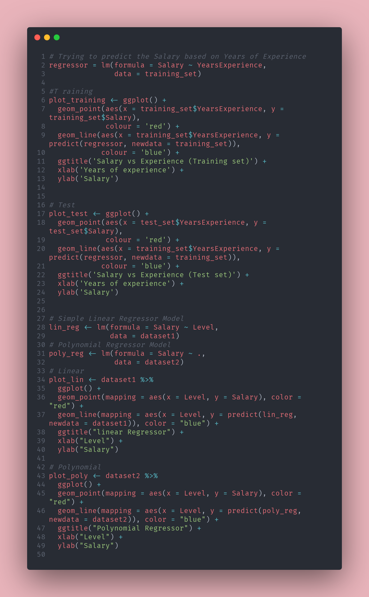

```{r setup, include = FALSE}
knitr::opts_chunk$set(collapse = TRUE, echo=TRUE, eval=TRUE, warning=FALSE, message=FALSE, comment="  ")
```

```{r, include = FALSE}
#Libraries
library(caTools)
library(tidyverse)
library(gridExtra)
#Simple
dataset = read.csv('Salary_Data.csv')
set.seed(123)
split = sample.split(dataset$Salary, SplitRatio = 2/3)
training_set = subset(dataset, split == TRUE)
test_set = subset(dataset, split == FALSE)
# Poly
dataset1 = read.csv('Position_Salaries.csv')
dataset1 <- dataset1[, 2:3]
dataset2 = read.csv('Position_Salaries.csv')
dataset2 <- dataset2[, 2:3]
```

In this post, we'll talk about **Simple Linear Regression** and **Polynomial Linear Regression**. These two represent the backbone for linear and continuous regressions.  

There's also **Multiple Linear Regression** but it requires a small chat about model building, so it'll be the content for a future post. 

[First things first](https://www.youtube.com/watch?v=2VTYuHaL_sk), let's dive deep into what is Regression. Regression can be defined as a set of statistical processes that are trying to estimate the relationship between a dependent variable and one or more independent variables, creating a model that best fits the data.  

We'll discuss more about what "best fit" means in a moment.

Today, it's often used as a way to predict the value of a dependent variable, given an independent variable. 

We can roughly divide Regression into Linear and Non-Linear Regression, and today we'll focus on the linear (and continuous) ones.

$$ y_i = \beta_0 + \beta_1 x_i + \epsilon_i $$

This is the model that represents a Simple Linear Regression and it's a straight line that fits the data, where $y$ is the dependent variable, $x$ is the independent variable, and $\beta_0$  and $\beta_1$ are regression coefficients that measure the relationship between  $y$  and  $x$ .  

$\beta_0$ is a constant and represents where the line crosses the vertical axis, while $\beta_1$ represents the slope of the line.
$\epsilon_i$ is a disturbance error or error variable that helps model the relationship between  $y$  and  $x$  adding an unobservable "noise". 

When we talk about  *model that best fits the data* we're referring to the way the algorithm for Linear Regression builds the model. In other non-scientific words, given data points in a scatterplot, what is the line that best represents the data or best adapts to the data and how can we obtain it?

There are all different kinds of methods for data fitting, and for Linear Regression the Least Squares method represents the standard approach.   

Basically, it draws an $n$ number of lines that fits the data (aka goes through them), and for each line, it calculates **the sum of squared residuals** where the residual is the difference between the observed values $y$ and the fitted value $\hat{y}$ that's provided by the model.

$$ \sum\limits_{i=1}^{n}(y_i – \hat{y}_1)^2 = min $$

Every time, the algorithm tries to minimize this `sum` and it stops when it's no longer able to minimize it and that's the model or the line that best fits the data. 

Before building a Linear Regression Model, some assumptions need checking.

1. Linearity
2. Homoscedasticity
3. Multivariate Normality
4. Independence of Errors
5. Lack of Multicollinearity 

We won't talk about this 'cause there's no time and I'm getting tired of typing on the keyboard, and plus we still gotta see how to build a model in R. And oh gosh, the Polynomial Regression, we need to check out that one too, almost forgot. Gotta move here, chop chop mf.

Let's see how we can build a simple Linear Regression Model. Dataset used are very small and just for article's sake.


```{r}
# Trying to predict the Salary based on Years of Experience
regressor = lm(formula = Salary ~ YearsExperience,
               data = training_set)
```
You can call `summary(regressor)` to look at coefficients.

Now let's visualize the Regressor, where the `blue` line represents our regressor and the `red` points
represent datapoints.
```{r}
plot_training <- ggplot() +
  geom_point(aes(x = training_set$YearsExperience, y = training_set$Salary),
             colour = 'red') +
  geom_line(aes(x = training_set$YearsExperience, y = predict(regressor, newdata = training_set)),
            colour = 'blue') +
  ggtitle('Salary vs Experience (Training set)') +
  xlab('Years of experience') +
  ylab('Salary')

plot_test <- ggplot() +
  geom_point(aes(x = test_set$YearsExperience, y = test_set$Salary),
             colour = 'red') +
  geom_line(aes(x = training_set$YearsExperience, y = predict(regressor, newdata = training_set)),
            colour = 'blue') +
  ggtitle('Salary vs Experience (Test set)') +
  xlab('Years of experience') +
  ylab('Salary')
```
```{r, echo=FALSE}
grid.arrange(plot_training, plot_test, ncol=2)
```

Ok now let's talk about Polynomial Linear Regression

$$ y_i = \beta_0 + \beta_1 x_i + \beta_2 x_1^{2} + \cdots + \beta_n x_1^{n} + \epsilon_i $$

Let's address the elephant in the room, how's this even linear? Well, Although it fits a nonlinear model to the data, as far as we're concerned, as a statistical estimation problem it is linear, in the sense that the regression function is linear in the unknown parameters that are estimated from the data. For this reason, it's also considered a special case of Multiple Linear Regression.  

Confusing much? We'll circle back to this when talking Multiple Linear Regression. 

To explain this concept in other words, we can say that a Polynomial Regression Model is composed of one independent variable and additional independent variables that are polynomial terms of the first independent variable.  


Let's see what it looks like. We'll build both a Linear Regressor and Polynomial Regressor for the same dataset to compare them and see how they are able to predict values.


```{r}
# Simple Linear Regressor Model
lin_reg <- lm(formula = Salary ~ Level,
              data = dataset1)
```
```{r, echo=FALSE}
dataset2$level4 <- dataset2$Level^4
```

```{r}
# Polynomial Regressor Model
poly_reg <- lm(formula = Salary ~ .,
               data = dataset2)
```

Now let's plot them and see how they behaves
```{r}
plot_lin <- dataset1 %>%
  ggplot() +
  geom_point(mapping = aes(x = Level, y = Salary), color = "red") +
  geom_line(mapping = aes(x = Level, y = predict(lin_reg, newdata = dataset1)), color = "blue") +
  ggtitle("linear Regressor") +
  xlab("Level") +
  ylab("Salary")

plot_poly <- dataset2 %>%
  ggplot() +
  geom_point(mapping = aes(x = Level, y = Salary), color = "red") +
  geom_line(mapping = aes(x = Level, y = predict(poly_reg, newdata = dataset2)), color = "blue") +
  ggtitle("Polynomial Regressor") +
  xlab("Level") +
  ylab("Salary") 
```
```{r, echo=FALSE}
grid.arrange(plot_lin, plot_poly, ncol=2)

```

That was it, hope you enjoyed that.


